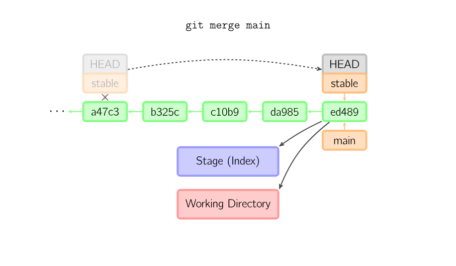
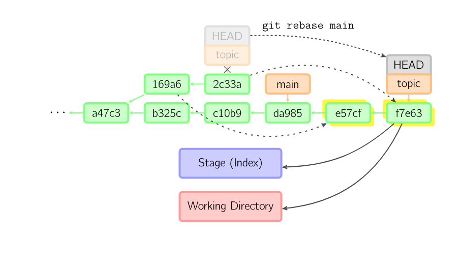

# 我的git工作流

最近研究了很久git，因为此前一直在使用git最简单的做法，即`git add . -> git commit -> git push`，直接在`main`分支上工作。学习了很多别人的项目后意识到这样完全不适合多人协作，而且对一些错误操作的容错率也很不理想。因此，我决定重新学习适合自己的git工作流，并记录下来。

## 省流（TLDR）

本文适合有基础git知识的朋友阅读。

我整合了三种适合个人项目和小型团队项目的工作流，并以脚本的形式提供。目前提供了通用性较强的`bash`脚本和我自己在使用的`nushell`脚本两种。

## ⭐ 分支管理

通常，git和github的默认分支是main（[master和main的区别是什么？](https://zhuanlan.zhihu.com/p/257179306)），你的git如果不是以`main`为默认分支名，可以通过以下命令修改：

```bash
git config --global init.defaultBranch main
```

对于一个极简的单人项目，如果项目没有构建、部署等需求（最常见的情况是作业文档、简单脚本等），那么项目仓库只有一个`main`分支是一个非常合理的事情，此时不要强求自己弄出多个分支，除了把自己弄得晕头转向外，不会从分支中获得过多的好处，因此不太建议。

对于一个相对正式的项目，如果主要由个人维护，那么可以在`main`分支之外开出一个`dev`分支，用于存放开发中的代码，在`dev`分支上完成开发后，将`dev`分支合并到`main`分支上。**`main`分支上的代码总是稳定的，可以随时部署到生产环境**，而`dev`分支上的代码是开发中的代码，可能不稳定，不应当用于构建和部署。

对于一个多人参与的、更为复杂的项目，仅有`main`和`dev`分支是不够的，多人在一个分支中工作会引入非常多的冲突，会导致混乱。此时我建议**针对每个待开发的特性或故障修复开一个单独的分支**（`feat/xxx`, `fix/xxx`, ...），尽量确保同一个开发分支内只有一个成员或尽量少的成员。

下面将针对这三种工作流展开来讲。

## 提交代码（`commit`）

提交代码在各种工作流中没有任何区别，下面直接给出脚本：

```nu
# Run `cm` without args when you want to commit. It'll stage all changes and show diff.
# After checking diff, you can run `cm` again with a commit message to actually commit.
export def cm [message?: string] {
  # Only allow commit on main branch if there's only one main branch.
  if ((current-branch) == "main" and (branch-count) > 1) {
    print "⚠️ Do not commit on main branch!"
    return
  }
  if ($message == null) {
    git add .
    print "📝 All changes are staged. Diff:"
    git diff --cached --numstat 
            | lines | parse "{added}\t{removed}\t{file}" 
            | rename "+" "-" "file" | print
    git diff --cached | bat --style=grid --color=always
  } else {
    git commit -am $message
  }
}
```
特别地，在多分支的工作流中，不能直接向`main`分支提交代码，**`main`分支应当总是接受来自别的分支的合并**。我的脚本的设计哲学是**尽量把用户会犯的错误提前捕获**，例如上面代码中当用户在当前分支为`main`、且有不止一个分支时提交代码会被直接拒绝，这有一点像Rust的理念。


## 极简工作流

如果只有一个`main`分支，`commit`后的工作就很直接：直接`push`到远程仓库即可。

```nu
export alias ps = git push -u origin HEAD
```

事实上这种简单的工作流根本不适合用脚本，VS Code等IDE其实挺方便的。

## 双分支工作流

可以先创建一个`dev`分支：

```
export def dev [] {
  if (has-branch 'dev') {  # internal
    git switch dev
  } else {
    input "📢 Create dev branch? (y/n): " | if ($in == "y") {
      git switch main
      git switch -c dev
    }
  }
}
```


开发功能之前，你的`dev`分支应当先与远程的分支保持同步：

```nu
export alias pl = git pull --rebase
```

接着你可以开始开发功能并提交代码。如果中途需要暂存到远端（比如要换个设备继续工作），只需要推送`dev`分支到远端即可。

功能开发完成并确保功能稳定后，可以合并到`main`分支：

```nu
# For some small personal projects, simply integrate current branch into main branch.
# Use it after you finish several commits on a branch.
# After this command, you may want to push both branches to remote.
export def inte [] {
  let current = (current-branch)
  if ($current == "main") {
    print "❌ This action is not applicable to main branch. Switch to another branch first."
    return
  }
  sync
  git switch main
  git merge $current --ff-only
  $current
}
```

这里`sync`是一个自定义的命令，我们先省略其实现细节，过后再讲；我们切换到`main`分支后，仅使用`fast-forward`方式合并（`--ff-only`选项），用于将`dev`分支比`main`分支更新的部分合并到`main`分支上。这里有一个示意图（注意，此图中`stable`充当`main`分支，`main`分支充当`dev`分支）：



这种合并方式不会产生新的提交（commit），只会移动`main`分支的指针，使得提交记录更清晰。

合并后，可以将两个分支都推送到远程仓库。

## 团队开发多分支工作流

这个工作流参考了哔哩哔哩博主码农高天的[视频](https://www.bilibili.com/video/BV19e4y1q7JJ)，他讲得非常详细和易懂。

和前面两种最大的差别在于，我们假设你不是项目的拥有者/维护者（owner/maintainer），不能直接向主分支贡献代码，而是需要打开Pull Request，请求合并到主分支。（[什么是Pull Request？](https://zhuanlan.zhihu.com/p/347918608)）

Fork原代码仓库后，你可以创建一个特性分支（`feat/xxx`）来开发新特性，或者创建一个修复分支（`fix/xxx`）来修复bug。开发完成后，将这个分支推送到自己的远程仓库。

📢 注意！如果在你开发期间，**原代码仓库（上游代码仓库）主分支有新的提交**，你的分支将无法与上游代码仓库合并！

该怎么做呢？这将是本文的一个难点，先看代码：

```nu
# Sync latest changes from main branch, and corporate into current branch.
# Now current branch is: latest main branch -> current branch changes.
# After this command, you may want to push current branch and open a pull request.
export def sync [] {
  if not (is-clean) {
    print "⚠️ Working directory is not clean. Please commit or stash your changes: "
    git-status
    return
  }
  let current = (current-branch)
  if ($current == "main") {
    print "📢 You are on main branch. This action will only update main branch."
  }

  # Sync remote fork from its parent.
  gh repo sync (git remote get-url origin)
  # Update main branch from origin.
  git switch main
  git pull --rebase origin main
  # Rebase changes onto our current branch.
  git switch $current
  git rebase main
}
```

主要分三步走：

1. 将原代码仓库（上游代码仓库）同步到你的Fork仓库中，这使用了`gh` CLI，详见[文档](https://cli.github.com/manual/gh_repo_sync)。

2. 更新本地的`main`分支到最新。

3. **将当前分支的更改重新应用到最新的 main 分支上**，确保当前分支的更改是最新的。🚀

这个变基的操作有一个示意图：



变基后，我们得到的分支如下（箭头表示先后顺序）：

```
旧main分支 -> 新main分支提交 -> 当前分支提交
```

完成后就可以把特性分支推送到自己的远程仓库，然后打开Pull Request请求合并到主分支了。

## 这已经是最完美了吗？

显然不是，这只是一个小型团队的工作流模型，对于一个成熟的企业或组织，有着相当多的细节需要处理，例如权限管理、代码审查、CI/CD等，这些内容超出了本文的范围，也很难拿出一个通用的解决方案。

学习本文将是你从一个git初级用户迈向中级用户的关键一步，希望能对你有所帮助！

## 附1：`master`还是`main`？

前面已经提到过，因为种族歧视的原因，现在github中`master`和`main`将会长期共存。我编写了一个函数返回当前的主分支：

```nu
export def master-or-main [] {
  if (git branch | lines | each { |it| $it | str trim | str replace '* ' ''  } | any { |it| $it == "main" }) {
    return "main"
  } else {
    return "master"
  }
}
```
